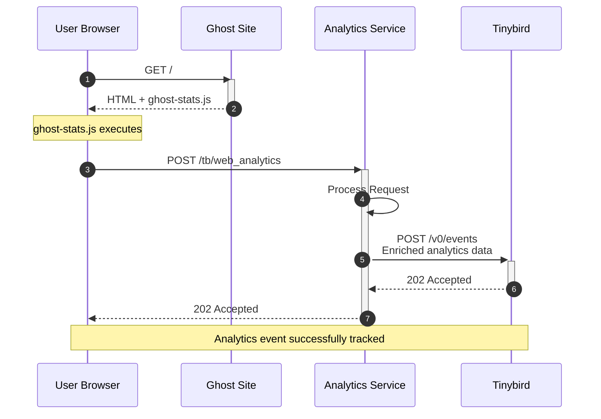

# Traffic Analytics

Traffic Analytics Service - A web analytics proxy for Ghost that processes and enriches traffic data before forwarding it to Tinybird's analytics API.

## How it Works
The following sequence diagram shows a simplified overview of where the Analytics Service fits in to Ghost's traffic analytics features.
1. A user requests a Ghost site's homepage (or any other page on the site's frontend)
2. Ghost serves the page's HTML, plus a script called `ghost-stats.js`
3. The `ghost-stats.js` script executes and sends a `POST` request to the Analytics Service's `POST /tb/web_analytics` endpoint
4. The Analytics Service receives the request and processes it. This includes parsing the user agent, generating a user signature, etc.
5. The Analytics Service proxies the request to Tinybird
6. Tinybird receives the request and stores it in its Clickhouse database
7. The Analytics Service then proxies the response from Tinybird back to the user's browser.



## Features

- User agent parsing for OS, browser, and device detection
- Referrer URL parsing and categorization
- Privacy-preserving user signatures with daily-rotating salts
- Configurable salt storage (in-memory or Firestore)
- Docker-first development with Firestore emulator support

## Configuration

Copy `.env.example` to `.env` and configure as needed:

- `PORT` - Server port (default: 3000)
- `LOG_LEVEL` - Logging level (default: info)
- `PROXY_TARGET` - Upstream URL to forward requests (default: http://localhost:3000/local-proxy)
- `SALT_STORE_TYPE` - Salt store implementation: memory or firestore (default: memory)
- `GOOGLE_CLOUD_PROJECT` - Google Cloud project ID for Firestore (required when using firestore salt store)
- `LOG_PROXY_REQUESTS` - Enable logging of proxy requests (default: true)
- `ENABLE_SALT_CLEANUP_SCHEDULER` - Enable automatic daily salt cleanup (default: true)
- `FIRESTORE_DATABASE_ID` - Firestore database ID (required when using firestore salt store)
- `PUBSUB_TOPIC_PAGE_HITS_RAW` - Pub/Sub topic for raw page hits (required for pub/sub functionality)
- `TRUST_PROXY` - Enable trust proxy to resolve client IPs from X-Forwarded-For headers (default: true)

## Develop

1. `git clone` this repo & `cd` into it as usual
2. Run `yarn` to install top-level dependencies.

## Build
- `yarn build` to transpile Typescript to JS
- `docker compose build` to build docker image

## Run

- `yarn dev` start development server in docker compose (includes Firestore, Pub/Sub emulator)
- View: [http://localhost:3000](http://localhost:3000)

## Run locally with Ghost

It is possible to run this Analytics Service locally alongside your local development instance of Ghost. This can be useful to test the full end-to-end flow from Ghost > `ghost-stats.js` > Analytics Service > Tinybird and back.

Here are the steps to get setup:
1. In the Ghost repo, run `yarn tb` to run Tinybird local and deploy the Tinybird schema defined in Ghost.
2. Now we need to retrieve some values from our tinybird-local container. :
    - `workspaceId`: run `tb info` in your Tinybird shell, and copy the `workspace_id` value
    - `adminToken`: run `tb token ls` and copy the token that is named "admin token"
    - `trackerToken`: run `tb token ls` and copy the token that is named "tracker"
3. Update your Ghost configuration in `ghost/core/config.local.json` or `ghost/core/config.local.jsonc` with the following:
```json
{
    "tinybird": {
        "workspaceId": "${workspaceId}",
        "adminToken": "${adminToken}",
        "tracker": {
            "endpoint": "http://localhost:3000/tb/web_analytics", // This points Ghost to your local instance of the Analytics Service for event ingestion
            "datasource": "analytics_events"
        },
        "stats": {
            "endpoint": "http://localhost:7181" // This points Ghost Admin to your local tinybird container for querying the API endpoints
        }
    }
}
```
5. Add the following to your `.env` file in the root of this repo:
```bash
TINYBIRD_TRACKER_TOKEN=${trackerToken} # From step 2
PROXY_TARGET=http://host.docker.internal:7181/v0/events # The URL of your Tinybird-local container
```
6. Start the Analytics Service with `yarn dev` from the root of this repo.
7. Start Ghost with `yarn dev` in a new terminal window from the root of your Ghost repo.

To confirm everything is working: 
- Load your local Ghost site's frontend in your browser at `http://localhost:2368` 
    - In your network tab, you should see a successful POST request to `/tb/web_analytics`
- Load Ghost admin in your browser at `http://localhost:2368/ghost` and navigate to the Analytics tab in the sidebar
    - You should see a "Unique Visitor" recorded in the main Overview tab

## Test

- `yarn test` run all tests in docker compose

## Lint
- `yarn lint` run eslint in docker compose

## Multi-Worktree Development

This project supports running multiple worktrees simultaneously using Docker Compose. Each worktree can run its own isolated development environment with unique ports and container names.

### Setup

1. **Create worktrees** as usual with git worktree
2. **Configure each worktree** with a unique `.env` file:

```bash
# main worktree (.env) - uses defaults
NODE_ENV=development

# work worktree (.env)  
NODE_ENV=development
COMPOSE_PROJECT_NAME=traffic-analytics-work
ANALYTICS_PORT=3001
FIRESTORE_PORT=8081

# scratch worktree (.env)
NODE_ENV=development  
COMPOSE_PROJECT_NAME=traffic-analytics-scratch
ANALYTICS_PORT=3002
FIRESTORE_PORT=8082
```

### Usage

Each worktree runs completely isolated:
- **Unique ports**: No conflicts between worktrees
- **Isolated containers**: Auto-generated names like `traffic-analytics-work-analytics-service-1`
- **Separate volumes**: Each worktree has its own `node_modules` volume
- **Independent projects**: Services can run simultaneously

```bash
# Start development in any worktree
cd /path/to/worktree
docker compose up

# Each worktree accessible on its configured port
# main: http://localhost:3000
# work: http://localhost:3001  
# scratch: http://localhost:3002
```

## Deployment

Merging to `main` automatically deploys to staging. Production deployments only happen when the version in `package.json` changes.

To ship to production:
1. `yarn ship` - creates a release branch with version bump
2. Create PR using the provided link
3. Merge the PR - this triggers production deployment

# Copyright & License 

Copyright (c) 2013-2025 Ghost Foundation - Released under the [MIT license](LICENSE).