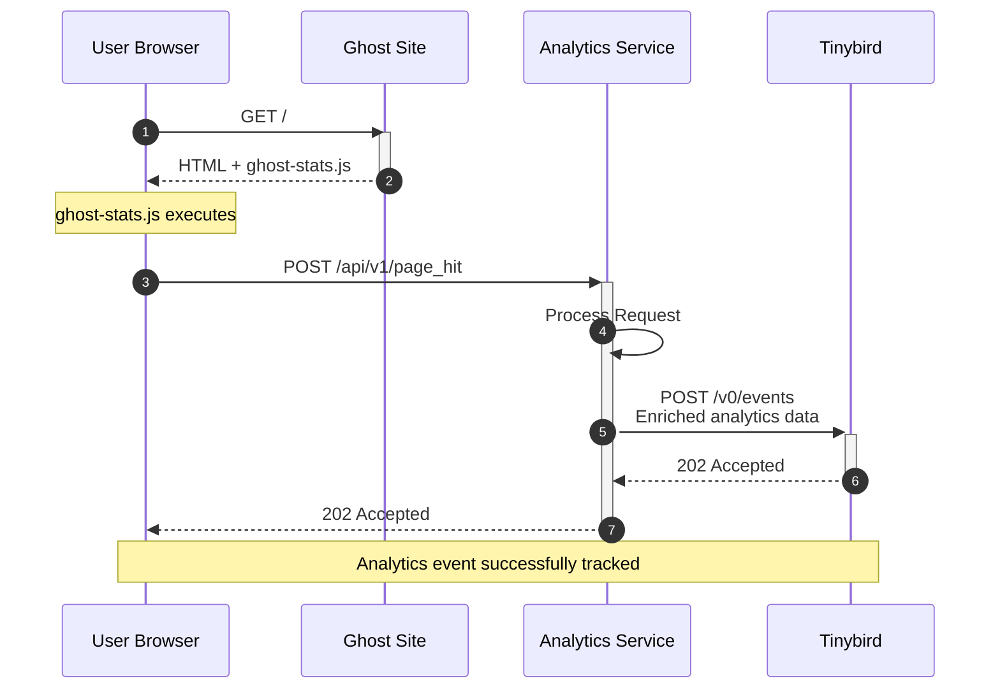

# Traffic Analytics


Traffic Analytics Service - A web analytics proxy for Ghost that processes and enriches traffic data before forwarding it to Tinybird's analytics API.

## How it Works
The following sequence diagram shows a simplified overview of where the Analytics Service fits in to Ghost's traffic analytics features.
1. A user requests a Ghost site's homepage (or any other page on the site's frontend)
2. Ghost serves the page's HTML, plus a script called `ghost-stats.js`
3. The `ghost-stats.js` script executes and sends a `POST` request to the Analytics Service's `POST /api/v1/page_hit` endpoint
4. The Analytics Service receives the request and processes it. This includes parsing the user agent, generating a user signature, etc.
5. The Analytics Service proxies the request to Tinybird
6. Tinybird receives the request and stores it in its Clickhouse database
7. The Analytics Service then proxies the response from Tinybird back to the user's browser.


```mermaid
sequenceDiagram
    autonumber
    participant User as User Browser
    participant Ghost as Ghost Site
    participant AS as Analytics Service
    participant TB as Tinybird

    User->>Ghost: GET /
    activate Ghost
    Ghost-->>User: HTML + ghost-stats.js
    deactivate Ghost
    
    Note over User: ghost-stats.js executes
    
    User->>+AS: POST /api/v1/page_hit
    
    AS->>AS: Process Request
    
    AS->>+TB: POST /v0/events<br/>Enriched analytics data
    TB-->>-AS: 202 Accepted
    
    AS-->>-User: 202 Accepted
    
    Note over User,TB: Analytics event successfully tracked
```

### Run modes

The "Process Request" and "forward to Tinybird" steps above happen in one of two ways, and this is how the service runs by default in development and production:

- **Batch mode (default)** — The ingest service validates requests and publishes events to Google Cloud Pub/Sub. A separate **worker** consumes page hits and automation events, batches them, and forwards them to Tinybird. Automation run and run-step events are kept in separate Tinybird batches. This decouples request handling from Tinybird ingestion. Started with `pnpm dev` (alias for `pnpm dev:batch`).
- **Proxy mode (synchronous)** — With no Pub/Sub topic configured, the ingest service filters bot traffic, enriches non-bot requests inline, and proxies them straight to Tinybird in the same request/response cycle. Started with `pnpm dev:proxy`.

Both modes run from the same image; the role is selected by the `WORKER_MODE` environment variable (worker vs. ingest). Page hits use `PUBSUB_TOPIC_PAGE_HITS_RAW` and automation events use `PUBSUB_TOPIC_AUTOMATION_EVENTS` to select batch vs. inline handling independently. See [docs/architecture.md](docs/architecture.md) for a diagram and full detail.

## Features

- User agent parsing for OS, browser, and device detection
- Referrer URL parsing and categorization
- Privacy-preserving user signatures with daily-rotating salts

## Configuration

Copy `.env.example` to `.env` and configure as needed. Set `ENABLE_BOT_DETECTION_HEADER=true` to include `x-ghost-bot-detected: true` on `202` responses for filtered bots; this response header is omitted by default. For local development with Ghost, see [Develop locally with Ghost](#develop-locally-with-ghost)

## Develop

Pre-requisites:
- A container runtime, such as Docker Desktop or Orbstack
- Docker Compose

1. `git clone` this repo & `cd` into it as usual
2. `pnpm dev` to build & start all required development services. The Analytics Service will be reachable at `http://localhost:3000`.

## Develop locally with Ghost

If you want to manually test the Analytics Service + Ghost together locally, there are just a few more steps to follow. You'll need this repo and TryGhost/Ghost cloned locally.

1. In Ghost, run `pnpm dev:analytics:local`. This starts Ghost, `tinybird-local`, and the published analytics image, while routing `/.ghost/analytics/**` requests to the stable network alias provided by this repository. The published analytics container remains running, but the gateway sends page hits to this local checkout instead.
1. In this repo, run `pnpm dev:ghost`. This starts the batch-mode ingest service and worker, joins them to Ghost's Docker network, and mounts its `shared-config` volume so they can reach `tinybird-local` with the generated tracker token.

Now when you visit Ghost at `http://localhost:2368`, you should see requests to `/.ghost/analytics/api/v1/page_hit` in this repository's logs, and the worker will send those events to the `tinybird-local` service running in the Ghost project.

## Test

- `pnpm test:types` — run Typescript typechecks in Docker
- `pnpm test:unit` — run all unit tests in Docker
- `pnpm test:integration` — run all integration tests in Docker
- `pnpm test` — run typechecks, unit tests and integration tests in Docker
- `pnpm test:e2e` — run e2e tests (with wiremock) in Docker

## Lint
- `pnpm lint` run eslint in docker compose


## Multi-Worktree Development

This project supports running multiple worktrees simultaneously using Docker Compose. Each worktree can run its own isolated development environment with unique ports and container names.

### Setup

1. **Create worktrees** as usual with git worktree
2. **Configure each worktree** with a unique `.env` file:

```bash
# main worktree (.env) - uses defaults
NODE_ENV=development

# work worktree (.env)  
NODE_ENV=development
COMPOSE_PROJECT_NAME=traffic-analytics-work
ANALYTICS_PORT=3001
FIRESTORE_PORT=8081

# scratch worktree (.env)
NODE_ENV=development  
COMPOSE_PROJECT_NAME=traffic-analytics-scratch
ANALYTICS_PORT=3002
FIRESTORE_PORT=8082
```

### Usage

Each worktree runs completely isolated:
- **Unique ports**: No conflicts between worktrees
- **Isolated containers**: Auto-generated names like `traffic-analytics-work-analytics-service-1`
- **Separate volumes**: Each worktree has its own `node_modules` volume
- **Independent projects**: Services can run simultaneously

```bash
# Start development in any worktree
cd /path/to/worktree
docker compose up

# Each worktree accessible on its configured port
# main: http://localhost:3000
# work: http://localhost:3001  
# scratch: http://localhost:3002
```

## Deployment

### Development Workflow

1. **Create a branch** and make your changes
2. **Open a PR** against `main`
3. **Optionally test on staging** by adding the `deploy-staging` label to your PR
   - This deploys your branch to staging without merging
   - The label is automatically removed after deployment
4. **Merge to main** when ready

### What happens on merge

When a PR is merged to `main`, the following happens automatically:

1. **Version bump** — The patch version is automatically incremented (e.g., 1.2.3 → 1.2.4)
2. **Tag creation** — A git tag is created and pushed (e.g., `v1.2.4`)
3. **Docker Hub** — The image is published to Docker Hub
4. **Deploy to staging and production** — Both environments are deployed in parallel
5. **Health checks** — Automated health checks run against both environments
6. **Slack notification** — The team is notified of the new release

### Manual deployment

You can manually trigger a deployment via the GitHub Actions UI by running the "Deploy" workflow with `workflow_dispatch`.

For the full pipeline (version bump, image build/push to GCP Artifact Registry, Docker Hub release, Cloud Run deploy, health checks, Slack notifications, and rollback), see [docs/deployment.md](docs/deployment.md).

## Documentation

- [docs/architecture.md](docs/architecture.md) — run modes (batch vs. proxy), the Pub/Sub pipeline, salt-store adapters, OpenTelemetry, and the worker.
- [docs/deployment.md](docs/deployment.md) — CI and deployment pipeline, staging/production, `deploy-staging` label, and rollback.

# Copyright & License 

Copyright (c) 2013-2026 Ghost Foundation - Released under the [MIT license](LICENSE).
