# Architecture

Traffic Analytics is a web analytics proxy for Ghost. It receives page-hit events from the `ghost-stats.js` browser script, enriches them (user-agent parsing, referrer parsing, and a privacy-preserving user signature), filters bot traffic, and forwards the result to [Tinybird](https://www.tinybird.co/)'s `/v0/events` endpoint for storage in ClickHouse.

## Run modes

The same Docker image runs in two roles, selected by the `WORKER_MODE` environment variable in [`server.ts`](../server.ts):

- **Ingest app** (`WORKER_MODE` unset — [`src/app.ts`](../src/app.ts)) — the Fastify HTTP server that receives `POST /api/v1/page_hit`.
- **Worker app** (`WORKER_MODE=true` — [`src/worker-app.ts`](../src/worker-app.ts)) — a Pub/Sub consumer that enriches events and forwards them to Tinybird. It exposes only health endpoints (`/` and `/health`) for Cloud Run.

The ingest app has two request-handling strategies (see [`src/handlers/page-hit-handlers.ts`](../src/handlers/page-hit-handlers.ts)), chosen by whether `PUBSUB_TOPIC_PAGE_HITS_RAW` is set:

- **Batch mode (default in dev and production)** — publish the raw event to the Pub/Sub topic and return `202` immediately. Enrichment and forwarding to Tinybird happen asynchronously in the worker app. This is the `dev:batch` Compose profile: `analytics-service` (ingest) + `worker`.
- **Proxy mode (synchronous)** — no topic set. The request is enriched inline and proxied straight to `PROXY_TARGET` (`/v0/events`) within the same request/response cycle. This is the `dev:proxy` Compose profile: `analytics-service-proxy`.

## Batch pipeline

```mermaid
flowchart LR
    Browser["Browser<br/>ghost-stats.js"]

    subgraph Ingest["Ingest app (src/app.ts)"]
        HMAC["HMAC validation<br/>(preValidation)"]
        Pre["Populate + validate<br/>(preHandler)"]
        Pub["Publish raw event"]
    end

    Topic(["Pub/Sub topic<br/>PUBSUB_TOPIC_PAGE_HITS_RAW"])
    Sub(["Pub/Sub subscription<br/>PUBSUB_SUBSCRIPTION_PAGE_HITS_RAW"])

    subgraph Worker["Worker app (src/worker-app.ts)"]
        Enrich["Enrich:<br/>user agent + referrer<br/>+ user signature"]
        Bots["Filter bot traffic"]
        Batch["Batch<br/>(BATCH_SIZE / flush interval)"]
    end

    TB["Tinybird<br/>POST /v0/events"]

    Browser -->|"POST /api/v1/page_hit"| HMAC
    HMAC --> Pre --> Pub
    Pub -->|"202 Accepted"| Browser
    Pub --> Topic --> Sub --> Enrich
    Enrich --> Bots --> Batch --> TB
```

Notes:
- **HMAC validation** ([`src/plugins/hmac-validation.ts`](../src/plugins/hmac-validation.ts)) is a global `preValidation` hook. It validates the signature and timestamp carried in the URL query parameters and strips them before downstream processing. It is skipped entirely if `HMAC_SECRET` is unset, and it can be run in log-only mode with `HMAC_VALIDATION_LOG_ONLY=true`.
- **Enrichment** ([`transformPageHitRawToProcessed`](../src/schemas/v1/page-hit-processed.ts)) parses the user agent with `ua-parser-js`, parses the referrer with `@tryghost/referrer-parser`, and computes the `session_id` user signature.
- **Bot filtering** drops events whose parsed device is `bot` before they reach Tinybird (in both the worker and the synchronous proxy path).
- **Batching** ([`src/services/batch-worker/BatchWorker.ts`](../src/services/batch-worker/BatchWorker.ts)) accumulates processed events and flushes them to Tinybird as newline-delimited JSON when the batch reaches `BATCH_SIZE` (default 50) or the flush timer fires (`BATCH_FLUSH_INTERVAL_MS`, default 1000ms). Messages are `ack`ed on a successful flush and `nack`ed on failure.

### Synchronous proxy mode

When `PUBSUB_TOPIC_PAGE_HITS_RAW` is not set, the ingest app enriches the request inline and proxies it directly to `PROXY_TARGET` using `@fastify/reply-from`, returning Tinybird's response to the caller. There is no Pub/Sub topic and no separate worker in this mode.

## Pub/Sub

- The publisher ([`src/services/events/publisher.ts`](../src/services/events/publisher.ts)) and subscriber ([`src/services/events/subscriber.ts`](../src/services/events/subscriber.ts)) both use `@google-cloud/pubsub` and read `GOOGLE_CLOUD_PROJECT` for the project ID.
- In local development and tests, a Pub/Sub emulator is used via `PUBSUB_EMULATOR_HOST`. The Compose stack creates the topic `traffic-analytics-page-hits-raw` and subscription `traffic-analytics-page-hits-raw-sub`.

## Salt store

User signatures depend on a daily-rotating salt, stored via an adapter pattern behind `ISaltStore` and selected by `SALT_STORE_TYPE` (see [`SaltStoreFactory.ts`](../src/services/salt-store/SaltStoreFactory.ts)):

- `memory` — in-process, lost on restart. This is the **code default**.
- `file` — JSON file at `SALT_STORE_FILE_PATH` (default `./data/salts.json`).
- `firestore` — Google Cloud Firestore; requires `GOOGLE_CLOUD_PROJECT` and `FIRESTORE_DATABASE_ID`. This is what Docker Compose dev/test use (via the Firestore emulator at `FIRESTORE_EMULATOR_HOST`) and what production uses.

The user signature ([`UserSignatureService`](../src/services/user-signature/UserSignatureService.ts)) is a SHA-256 hash of `salt : site_uuid : ip : user-agent`, where the salt is keyed by date and site UUID so it rotates daily per site. A cleanup scheduler periodically deletes expired salts (`ENABLE_SALT_CLEANUP_SCHEDULER`, `FIRESTORE_CLEANUP_BATCH_SIZE`).

## Observability

OpenTelemetry is initialised in [`src/utils/instrumentation.ts`](../src/utils/instrumentation.ts) before the app loads:

- The trace exporter is Jaeger (OTLP HTTP) by default, or Google Cloud Trace when `OTEL_TRACE_EXPORTER=gcp` or `K_SERVICE` is set (Cloud Run sets `K_SERVICE` automatically).
- OTLP endpoints default to the `jaeger` service (`OTEL_EXPORTER_OTLP_TRACES_ENDPOINT`, `OTEL_EXPORTER_OTLP_METRICS_ENDPOINT`).
- The reported service name is `analytics-worker` in worker mode and `analytics-service` otherwise.

## Related docs

- [Deployment](deployment.md) — CI and the deploy pipeline.
- [AGENTS.md](../AGENTS.md) — module map, commands, and environment variables for contributors and coding agents.
