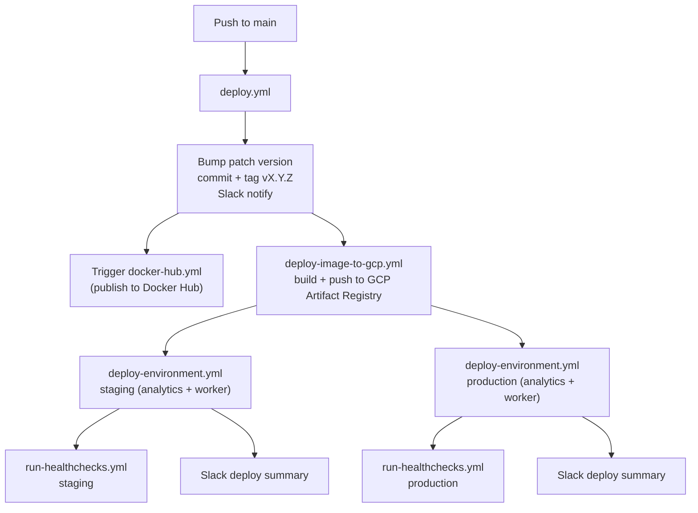

# Deployment

Traffic Analytics deploys to **Google Cloud Run** in a single region (`europe-west4`, "netherlands"), across **staging** and **production** environments. Each environment runs two Cloud Run services: the ingest service and the worker.

All deployment logic lives in [`.github/workflows/`](../.github/workflows) and a set of composite actions under [`.github/actions/`](../.github/actions).

## Pipeline overview



## Deploy on merge to `main` — [`deploy.yml`](../.github/workflows/deploy.yml)

Triggered on every push to `main` (and via manual `workflow_dispatch`). Jobs:

1. **Bump Version** — bumps the patch version with `npm version patch` (e.g. `1.2.3 → 1.2.4`), commits it as `vX.Y.Z [skip ci]`, pushes to `main`, and creates + pushes the `vX.Y.Z` git tag. Sends a Slack "new version released" notification. (The commit carries `[skip ci]`, so it does not re-trigger CI/deploy; a `GH_PAT` authorizes the push and tag to the protected branch, and the Docker Hub build is dispatched explicitly by the next job.)
2. **Trigger Docker Hub Deploy** — dispatches [`docker-hub.yml`](../.github/workflows/docker-hub.yml) at the new `vX.Y.Z` tag.
3. **Build** — calls [`deploy-image-to-gcp.yml`](../.github/workflows/deploy-image-to-gcp.yml) to build and push the image to GCP Artifact Registry.
4. **Deploy Staging** and **Deploy Production** — both call [`deploy-environment.yml`](../.github/workflows/deploy-environment.yml) after the build, so the two environments deploy in parallel. Each deploys the `analytics` and `worker` services.
5. **Healthcheck Staging / Production** — each runs [`run-healthchecks.yml`](../.github/workflows/run-healthchecks.yml), gated on its deploy job reporting `success`.

## Build & push image — [`deploy-image-to-gcp.yml`](../.github/workflows/deploy-image-to-gcp.yml)

A reusable (`workflow_call`) workflow that:

- Looks up a **build cache** image in GHCR keyed by the git tree SHA (`ghcr.io/<repo>:tree-<treeSHA>`, pushed by CI on PRs — see below). On a cache hit it reuses that image; otherwise it builds via the `docker-build` action and runs `lint-and-test`.
- Authenticates to Google Cloud via Workload Identity and logs in to GCP Artifact Registry (`europe-docker.pkg.dev`).
- Generates tags (`edge` on main, semver tags derived from the `vX.Y.Z` git tag, and `sha-<commit>`) and pushes them to the `DOCKER_IMAGE` repository.
- Outputs the `image` (`<DOCKER_IMAGE>:sha-<sha>`) and `version` used by the deploy jobs.

## Deploy to an environment — [`deploy-environment.yml`](../.github/workflows/deploy-environment.yml)

Reusable workflow that takes `environment`, `image`, `region`, `region_name`, and a JSON `services` array. It runs a matrix over the services, deploying each to Cloud Run via the [`deploy-gcp-cloud-run`](../.github/actions/deploy-gcp-cloud-run) composite action. Cloud Run service names follow:

```text
<stg|prd>-<region_name>-traffic-analytics[-worker]
```

(the `-worker` suffix is added for the `worker` service). A `notify` job then posts a Slack deployment summary.

## Docker Hub release — [`docker-hub.yml`](../.github/workflows/docker-hub.yml)

Runs on `workflow_dispatch` (dispatched by `deploy.yml` at the release tag). It only publishes when the tag at `HEAD` matches the current `package.json` version **and** that version differs from the previous commit's version. When triggered, it builds a **multi-architecture** image, runs lint & test, and pushes to Docker Hub as `ghost/traffic-analytics` with `edge`, semver, and `sha` tags.

## Health checks — [`run-healthchecks.yml`](../.github/workflows/run-healthchecks.yml) and [`healthchecks.yml`](../.github/workflows/healthchecks.yml)

`run-healthchecks.yml` is reusable: given an `environment`, it expands to a matrix of known URLs (subdomain, custom-domain, and subdirectory variants for staging/production) and runs the [`run-healthchecks`](../.github/actions/run-healthchecks) action against each, notifying Slack on failure. It is invoked by the deploy pipeline and, on an hourly schedule (plus manual dispatch), by `healthchecks.yml` for continuous monitoring.

The workflow requires the `HEALTHCHECK_WAF_BYPASS_TOKEN` GitHub Actions secret. Playwright sends its value in `X-Ghost-Analytics-Healthcheck-Token` only on `/.ghost/analytics/**` requests whose origin exactly matches the test's configured `TEST_BASE_URL`. Credentialed requests must not automatically follow redirects; each redirect destination is checked against that origin and the token is omitted if the destination is not trusted. Configure the WAF with a narrowly scoped allow rule requiring both the analytics path and an exact header-value match. Generate a high-entropy token (for example, `openssl rand -hex 32`), store the same value in the WAF and the repository secret, redact it from WAF/CDN logs, and remove it before forwarding the request to the origin. Fastly must unset client-supplied `X-SigSci-No-Inspection` at the start of edge request processing, before trusted VCL can set it; never use that header as the healthcheck credential. Playwright tracing is disabled when the token is present because traces capture request headers.

## Deploy a PR branch to staging (the `deploy-staging` label) — [`deploy-staging.yml`](../.github/workflows/deploy-staging.yml)

To test a branch on staging **without merging**, add the **`deploy-staging`** label to its PR. The workflow:

1. Waits for the PR's CI run to finish if one is in progress.
2. Builds and pushes the image, then deploys the `analytics` and `worker` services to staging.
3. Runs staging health checks.
4. In a `finalize` step (always runs): comments on the PR with the result and the tree SHA, then **removes the `deploy-staging` label** so it can be re-applied to deploy again.

## Rollback — [`rollback.yml`](../.github/workflows/rollback.yml)

Manual `workflow_dispatch` with two inputs: `environment` (`staging`, `production`, or `both`) and `tag` (a Docker tag already present in GCP Artifact Registry). It redeploys `<DOCKER_IMAGE>:<tag>` to the chosen environment(s) via `deploy-environment.yml`. Note that rollback deploys only the `analytics` service.

## CI on pull requests — [`ci.yml`](../.github/workflows/ci.yml)

On PRs to `main`, CI builds the Docker image and runs lint & tests across a Node version matrix (`20`, `22`, and the version pinned in the Dockerfile). For the Dockerfile-pinned leg it pushes the built image to GHCR tagged `tree-<treeSHA>`, which the deploy pipeline later reuses as a build cache.

## Housekeeping — [`cleanup-ghcr.yml`](../.github/workflows/cleanup-ghcr.yml)

A nightly (06:00 UTC) scheduled job (plus manual dispatch) that prunes old GHCR container image versions, keeping the most recent 15.

> [`test.yml`](../.github/workflows/test.yml) is a manual-dispatch placeholder and is not part of the deploy pipeline.

## Local release helper — `yarn ship`

[`scripts/ship.js`](../scripts/ship.js) is an **optional** local helper (not part of CI). Run from an up-to-date `main`, it prompts for a bump type, creates a `release/vX.Y.Z` branch with the version bump committed, and pushes it so you can open a PR. The automated version bump described above still happens in `deploy.yml` when that PR merges.

## Related docs

- [Architecture](architecture.md) — run modes, the Pub/Sub pipeline, and the worker.
- [README](../README.md#deployment) — the contributor-facing deployment summary.
